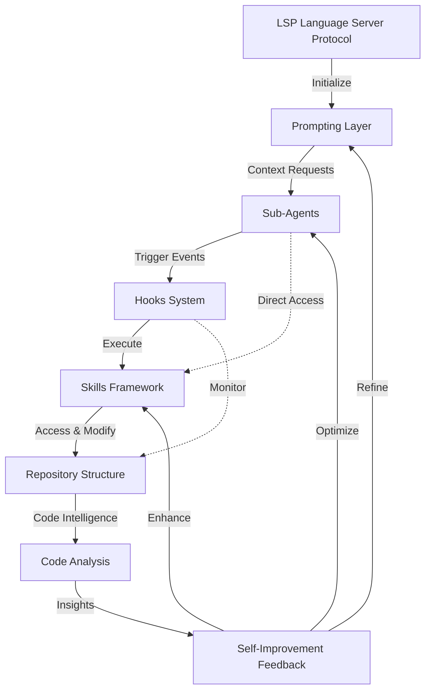

# Claude Code LSP Integration: Executive Summary

**Research Completion Date:** January 7, 2026  
**Document Status:** FINAL RESEARCH FINDINGS

---

## Overview

Claude Code now supports Language Server Protocol (LSP) for code intelligence features like go-to-definition, find-references, and hover documentation. LSP gives Claude semantic understanding of your codebase when combined with the right prompting, sub-agents, hooks, skills, and repo structure.

This document summarizes how to adapt your Claude Code setup to take advantage of LSP across six dimensions:

1. Prompting
2. Sub-agent definitions
3. Hooks
4. Skills
5. Repository structure
6. Self-improving skills

## LSP Integration Strategy Flow

The following flowchart illustrates how LSP integrates with Claude Code's architecture:



---

## LSP Capabilities in Claude Code

**Key LSP features:**

- **Go-to-definition**: Jump to symbol definitions across files.
- **Find-references**: List all usages of a symbol.
- **Hover documentation**: See type info and docs at a symbol.
- **Symbol resolution**: Distinguish between identically named symbols by context.

**Configuration basics:**

- LSP servers are configured via a `.lsp.json` file at the project or plugin root.
- Each language entry specifies:
  - `command`: LSP server binary (e.g. `pyright`, `gopls`).
  - optional `args`: extra flags.
  - `extensionToLanguage`: maps file extensions to language IDs.
- LSP logging can be enabled via the CLI to debug communication and server behavior.

---

## How Prompting Should Change

**Old style prompts:**

- “Search for where `authenticate` is used.”
- “Find all the places this variable appears.”
- “Where is this function defined in the text?”

These rely on text/grep-like reasoning.

**LSP-aware prompt style:**

- “Use LSP **go-to-definition** to jump to the definition of `authenticate`, then use **find-references** to list all callers and use **hover** to show its type signature.”
- “Before changing the `User` type, use LSP **find-references** to enumerate all usages, then assess which ones might break.”
- “For these edits, verify type safety by using **hover** on the modified functions and their callers.”

**Patterns:**

- Prefer **symbol-first** instructions (“use go-to-definition on `Foo.bar`”) instead of raw search (“grep for ‘Foo’”).
- Ask for **impact analysis** using find-references before refactors.
- Ask for **type-aware review** with hover before merge or deploy.

---

## Sub-Agent Definitions with LSP

Sub-agents should be explicitly LSP-aware so the model chooses them for semantic code tasks.

**Recommended agents:**

1. **`lsp-navigator`**
   - Purpose: Navigate and understand unfamiliar code.
   - Uses:
     - go-to-definition to find definitions and implementations.
     - find-references to see all usages.
     - hover to get type signatures and docs.

2. **`dependency-analyzer`**
   - Purpose: Map dependencies and coupling between modules.
   - Uses:
     - find-references to see who imports or calls what.
     - go-to-definition to follow dependency chains.

3. **`type-checker`**
   - Purpose: Verify type safety before merge/deploy.
   - Uses:
     - hover to extract parameter/return types.
     - find-references to ensure callers remain type-compatible.

**Key change:** Sub-agent descriptions must mention LSP explicitly and describe how they use go-to-definition, find-references, and hover so Claude routes the right tasks to them.

---

## Hooks with LSP

Hooks can use LSP semantics to act as automated safety rails.

**Patterns:**

- **PreToolUse (before edits):**
  - Warn if a symbol being changed has many references.
  - Encourage running LSP-based impact analysis on heavily used symbols.

- **PostToolUse (after edits):**
  - Run LSP-based type validation on modified files.
  - Surface likely type mismatches or high-risk changes.

- **SessionStart:**
  - Check that required LSP servers are installed and responding.
  - Warn if a language server is missing or misconfigured.

**Goal:** Make LSP-backed checks a normal part of the edit loop instead of a manual step.

---

## Skills with LSP

Skills encode reusable patterns for using LSP effectively.

**Core skills to define:**

1. **Symbol navigation**
   - “Given a symbol, use go-to-definition and find-references to show definition, type, and all usages.”

2. **Dependency analysis**
   - “Given a module/file, map incoming and outgoing dependencies using references and definitions.”

3. **Type safety checking**
   - “Given code changes, use hover and references to detect parameter/return type mismatches and unsafe call sites.”

4. **LSP-guided refactoring**
   - “When refactoring a symbol, use references to enumerate impact, then verify type safety across all callers.”

**Best practice:** Keep the main SKILL.md concise (when to use, high-level steps) and put deeper patterns and scripts into adjacent files which the skill can call when needed.

---

## Repository Structure for LSP

A clean structure makes LSP behavior predictable and shareable:

```text
my-project/
├── .lsp.json                  # LSP server configuration
├── .claude/
│   ├── CLAUDE.md              # High-level guidance (including LSP usage)
│   ├── agents/
│   │   ├── lsp-navigator/
│   │   │   └── AGENT.md
│   │   ├── dependency-analyzer/
│   │   │   └── AGENT.md
│   │   └── type-checker/
│   │       └── AGENT.md
│   ├── skills/
│   │   ├── lsp-symbol-navigation/
│   │   │   └── SKILL.md
│   │   ├── lsp-dependency-analysis/
│   │   │   └── SKILL.md
│   │   └── lsp-type-safety-check/
│   │       └── SKILL.md
│   └── hooks/
│       ├── hooks.json
│       ├── lsp-type-validator.py
│       └── lsp-reference-checker.py
└── src/ ...

