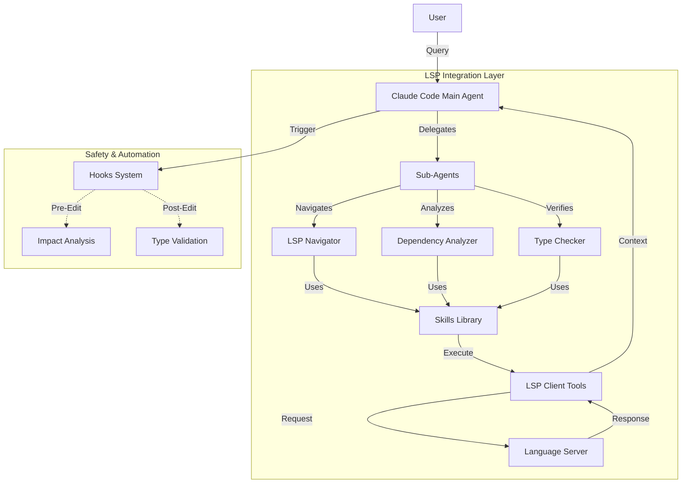

# Skillz: Claude Code LSP Integration Reference

This repository serves as a comprehensive reference implementation and research archive for integrating the **Language Server Protocol (LSP)** with **Claude Code**.

It demonstrates how to transform Claude from a text-based coding assistant into a semantic-aware IDE partner by leveraging LSP for "go-to-definition", "find-references", "hover", and more.

## 📚 Overview

Traditional LLM coding relies on text search (grep) which can be inaccurate for complex codebases. LSP integration gives Claude "X-ray vision" into your code, allowing it to understand symbols, types, and dependencies just like a modern IDE.

This project covers six dimensions of LSP integration:
1.  **Prompting Strategy**: How to ask for semantic operations.
2.  **Sub-Agents**: Specialized personas for navigation, analysis, and checking.
3.  **Hooks**: Automated guardrails for safety.
4.  **Skills**: Reusable patterns for LSP usage.
5.  **Repository Structure**: Optimized layout for tools.
6.  **Self-Improvement**: Feedback loops for skills.

## 🏗️ Architecture

The following diagram illustrates how the components in this repository interact to provide an LSP-enhanced workflow:



## 📂 Repository Structure

```text
skillz/
├── .lsp.json                  # LSP server configuration
├── .claude/
│   ├── CLAUDE.md              # High-level guidance
│   ├── agents/                # Specialized sub-agents
│   │   ├── lsp-navigator/
│   │   ├── dependency-analyzer/
│   │   └── type-checker/
│   ├── skills/                # Reusable LSP skills
│   │   ├── lsp-symbol-navigation/
│   │   ├── lsp-dependency-analysis/
│   │   └── lsp-type-safety-check/
│   └── hooks/                 # Automated checks
│       ├── hooks.json
│       └── scripts...
└── Docs/                      # Research & Documentation
    ├── lsp-integration.md     # Integration Strategy
    ├── lsp-research-findings.md # Detailed Findings
    └── lsp_implementation_quick_reference.md
```

## 🚀 Getting Started

To use the patterns in this repository with your own Claude Code setup:

1.  **Configure LSP**: Copy `.lsp.json` to your project root and ensure you have the necessary language servers installed (e.g., `pyright`, `typescript-language-server`).
2.  **Install Agents & Skills**: Copy the `.claude/` directory to your project.
3.  **Adopt Prompting**: Read `Docs/lsp_implementation_quick_reference.md` to learn how to prompt Claude effectively with LSP.

## 📖 Documentation

- **[Executive Summary & Integration Strategy](Docs/lsp-integration.md)**: High-level overview of the integration approach.
- **[Detailed Research Findings](Docs/lsp-research-findings.md)**: In-depth analysis, rationale, and examples.
- **[Implementation Quick Reference](Docs/lsp_implementation_quick_reference.md)**: Cheatsheet for prompts and configurations.
- **[Methodology](Docs/lsp-methodology.md)**: How the research was conducted.

## ✨ Key Capabilities

### 🔍 Semantic Navigation
Instead of "search for `User`", use **LSP Navigator** to "jump to the definition of `User` and show all references". This handles aliasing and scope correctly.

### 🕸️ Dependency Analysis
Map out how modules are coupled. The **Dependency Analyzer** agent can trace imports and call graphs to help you understand the impact of changes.

### 🛡️ Type Safety
Verify changes before applying them. The **Type Checker** agent and hooks can validate that your refactors don't break type contracts across the codebase.

---

*Research completed January 7, 2026.*

## 🔗 References

1.  [Claude Code Sub-agents Documentation](https://code.claude.com/docs/en/sub-agents)
2.  [Claude Code Skills Documentation](https://code.claude.com/docs/en/skills)
3.  [Claude Code Hooks Documentation](https://code.claude.com/docs/en/hooks-guide)
4.  [Claude Code Plugins Reference](https://code.claude.com/docs/en/plugins-reference)
5.  [Claude Code Plugins Documentation](https://code.claude.com/docs/en/plugins)
6.  [Claude Code Common Workflows](https://code.claude.com/docs/en/common-workflows)
7.  [Claude Code MCP Documentation](https://code.claude.com/docs/en/mcp)
8.  [Reddit: LSP is coming to Claude Code](https://www.reddit.com/r/ClaudeAI/comments/1otdfo9/lsp_is_coming_to_claude_code_and_you_can_try_it/)
9.  [YouTube: Claude Code LSP Demo](https://www.youtube.com/watch?v=cPTEal0ILDI)
10. [YouTube: Claude Code Features](https://www.youtube.com/watch?v=lffYEu5MhSQ)
11. [LinkedIn: Claude Code LSP Support](https://www.linkedin.com/pulse/claude-code-now-has-lsp-support-heres-why-actually-matters-harwood-h27hc)
12. [AI Free API: Claude Code LSP](https://www.aifreeapi.com/en/posts/claude-code-lsp)
13. [LinkedIn: Claude Platform Skills](https://www.linkedin.com/pulse/claude-platform-skills-plugins-subagents-tools-hooks-charles-guo-302yc)
14. [Reddit: Skills, Agents, Plugins](https://www.reddit.com/r/ClaudeCode/comments/1pyjl4r/skills_agents_plugins/)
15. [Spec Weave: LSP Glossary](https://spec-weave.com/docs/glossary/terms/lsp/)
16. [Young Leaders Tech: Claude Skills](https://www.youngleaders.tech/p/claude-skills-commands-subagents-plugins)
17. [Lee Han Chung: Claude Skills Deep Dive](https://leehanchung.github.io/blogs/2025/10/26/claude-skills-deep-dive/)
18. [GitHub: cclsp](https://github.com/ktnyt/cclsp)
19. [GitHub: Claude Code Showcase](https://github.com/ChrisWiles/claude-code-showcase)
20. [X (Twitter): Akiojin Status](https://x.com/akiojin/status/2002316767310274871)
21. [Blog: How I Use Every Claude Code Feature](https://blog.sshh.io/p/how-i-use-every-claude-code-feature)
22. [Bear Blog: My Experience with Claude Code 2.0](https://sankalp.bearblog.dev/my-experience-with-claude-code-20-and-how-to-get-better-at-using-coding-agents/)
23. [GitHub Issue: Claude Code #5495](https://github.com/anthropics/claude-code/issues/5495)
24. [GitHub: Awesome Claude Code](https://github.com/hesreallyhim/awesome-claude-code)
25. [Reddit: Realtime LSP Diagnostics Tool](https://www.reddit.com/r/ClaudeCode/comments/1msfyrm/i_built_a_tool_to_get_realtime_lsp_diagnostics/)

